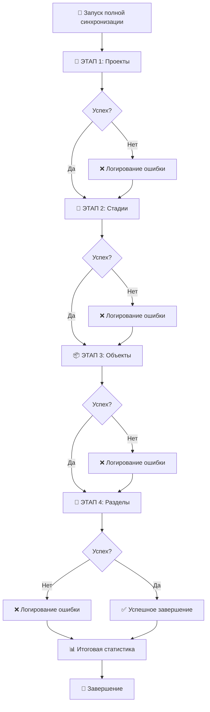

# 🚀 Полная синхронизация данных

Документация по функции полной синхронизации всех данных из Worksection в eneca.work.

## 📋 Описание

Полная синхронизация - это автоматизированный процесс, который последовательно выполняет синхронизацию всех типов данных в правильном порядке:

1. **🏢 Проекты** (Projects)
2. **🎯 Стадии** (Stages) 
3. **📦 Объекты** (Objects)
4. **📑 Разделы** (Sections)

## 🎯 Преимущества

### ✅ Автоматизация
- Один клик для синхронизации всех данных
- Правильная последовательность выполнения
- Отсутствие ручных ошибок

### 📊 Детальное логирование
- Подробные логи каждого этапа
- Информация о каждом созданном/обновленном элементе
- Статистика по операциям и ошибкам
- Время выполнения каждого этапа

### 🛡️ Надежность
- Продолжение работы при ошибках
- Откат состояния кнопки при сбоях
- Детальная диагностика проблем

## 🔄 Алгоритм работы



## 🌐 API Endpoint

### POST `/api/sync/full`

**Описание:** Запускает полную синхронизацию всех данных

**Параметры:** Нет

**Ответ:**
```json
{
  "success": true,
  "duration": "45.2",
  "summary": {
    "created": 15,
    "updated": 8,
    "errors": 0,
    "total_operations": 23
  },
  "details": {
    "projects": { /* результат синхронизации проектов */ },
    "stages": { /* результат синхронизации стадий */ },
    "objects": { /* результат синхронизации объектов */ },
    "sections": { /* результат синхронизации разделов */ }
  },
  "logs": [
    "🚀 === НАЧАЛО ПОЛНОЙ СИНХРОНИЗАЦИИ ===",
    "⏰ Время начала: 17.06.2024, 15:30:25",
    "🏢 ЭТАП 1/4: Синхронизация проектов...",
    "✅ Проекты: создано 3, обновлено 2, ошибок 0",
    // ... остальные логи
  ],
  "timestamp": "2024-06-17T12:30:25.123Z"
}
```

## 🖥️ Веб-интерфейс

### Кнопка запуска
- **Расположение:** Отдельный блок "Полная синхронизация" 
- **Стиль:** Зеленый градиент с тенью
- **Размер:** Увеличенный (16px padding, 32px horizontal)
- **Состояния:**
  - Обычное: "🚀 Запустить полную синхронизацию"
  - Активное: "🚀 Выполняется полная синхронизация..." (disabled)

### Логи
- **Автоочистка:** При наличии >50 логов очищается для читаемости
- **Цветовая кодировка:**
  - 🔵 INFO - обычная информация
  - 🟢 SUCCESS - успешные операции  
  - 🟡 WARNING - предупреждения
  - 🔴 ERROR - ошибки
- **Автопрокрутка:** Включена по умолчанию

## 📊 Детальное логирование

### Структура логов

```
🚀 === НАЧАЛО ПОЛНОЙ СИНХРОНИЗАЦИИ ===
⏰ Время начала: 17.06.2024, 15:30:25

🏢 ЭТАП 1/4: Синхронизация проектов...
✅ Проекты: создано 3, обновлено 2, ошибок 0
  📝 Созданные проекты:
    + Новый проект 1 (ID: abc123)
    + Новый проект 2 (ID: def456)
  📝 Обновленные проекты:
    ↻ Обновленный проект (ID: ghi789)

🎯 ЭТАП 2/4: Синхронизация стадий...
✅ Стадии: создано 5, обновлено 3, ошибок 0
  📝 Созданные стадии:
    + Стадия 1 (Проект: Новый проект 1)
    + Стадия 2 (Проект: Новый проект 1)

📦 ЭТАП 3/4: Синхронизация объектов...
✅ Объекты: создано 7, обновлено 2, ошибок 0
  📝 Созданные объекты:
    + Объект 1 (Стадия: Стадия 1)
    + Объект 2 (Стадия: Стадия 1)

📑 ЭТАП 4/4: Синхронизация разделов...
✅ Разделы: создано 0, обновлено 1, ошибок 0
  📝 Обновленные разделы:
    ↻ Раздел 1 (Объект: Объект 1)

🏁 === ЗАВЕРШЕНИЕ ПОЛНОЙ СИНХРОНИЗАЦИИ ===
⏱️ Общее время выполнения: 45.2 сек
✅ Всего создано: 15
🔄 Всего обновлено: 8  
❌ Всего ошибок: 0
📈 Всего операций: 23
⏰ Время завершения: 17.06.2024, 15:31:10
🎉 ПОЛНАЯ СИНХРОНИЗАЦИЯ ЗАВЕРШЕНА УСПЕШНО!
```

### Логи ошибок

```
🏢 ЭТАП 1/4: Синхронизация проектов...
❌ Ошибка синхронизации проектов: Connection timeout
  ❌ Ошибки проектов:
    ⚠️ Проект "Тестовый" - не удалось найти менеджера

🎯 ЭТАП 2/4: Синхронизация стадий...
✅ Стадии: создано 0, обновлено 0, ошибок 1
  ❌ Ошибки стадий:
    ⚠️ Задача "Задача без проекта" - родительский проект не найден

📊 ИТОГОВАЯ СТАТИСТИКА:
⏱️ Время выполнения: 12.5 секунд
✅ Создано записей: 5
🔄 Обновлено записей: 3
❌ Ошибок: 2
📈 Всего операций: 10
⚠️ ПОЛНАЯ СИНХРОНИЗАЦИЯ ЗАВЕРШЕНА С 2 ОШИБКАМИ
```

## ⚡ Быстрые команды

### Веб-интерфейс
```javascript
// Запуск полной синхронизации программно
document.getElementById('fullSync').click();
```

### API
```bash
# Запуск через curl
curl -X POST http://localhost:3001/api/sync/full \
  -H "Content-Type: application/json"
```

### JavaScript
```javascript
// Запуск через fetch
const response = await fetch('/api/sync/full', {
  method: 'POST',
  headers: { 'Content-Type': 'application/json' }
});
const result = await response.json();
console.log(result);
```

## 🚨 Обработка ошибок

### Типы ошибок

1. **Критические ошибки** - останавливают весь процесс
   - Отсутствие подключения к Worksection
   - Отсутствие подключения к Supabase
   - Неверные переменные окружения

2. **Ошибки этапа** - записываются в логи, процесс продолжается
   - Ошибки обработки отдельных элементов
   - Проблемы с маппингом данных
   - Нарушения целостности данных

3. **Предупреждения** - не критичны, процесс продолжается
   - Отсутствие данных для синхронизации
   - Устаревшие данные
   - Несоответствие форматов

### Действия при ошибках

- **Автоматическое логирование** всех ошибок
- **Продолжение выполнения** следующих этапов
- **Итоговая статистика** с количеством ошибок
- **Предложение скачать логи** при критических ошибках

## 📈 Мониторинг и статистика

### Метрики производительности
- Время выполнения каждого этапа
- Общее время синхронизации
- Количество операций в секунду
- Использование памяти

### Статистика операций
- Количество созданных записей по типам
- Количество обновленных записей по типам  
- Количество ошибок по типам
- Процент успешных операций

## 🔧 Настройка и конфигурация

### Переменные окружения
Используются те же переменные, что и для отдельных синхронизаций:

```bash
# Supabase
SUPABASE_URL=https://your-project.supabase.co
SUPABASE_SERVICE_ROLE_KEY=your-service-role-key

# Worksection  
WORKSECTION_DOMAIN=your-domain.worksection.com
WORKSECTION_HASH=your-api-hash

# Сервер
PORT=3001
```

### Ограничения
- **Timeout:** 5 минут на весь процесс
- **Memory:** Ограничено памятью Node.js процесса
- **Rate limiting:** Соблюдение лимитов Worksection API

## 🎯 Рекомендации по использованию

### Когда использовать
- ✅ Первоначальная настройка системы
- ✅ Регулярная синхронизация (раз в день/неделю)
- ✅ После внесения больших изменений в Worksection
- ✅ Восстановление после сбоев

### Когда НЕ использовать
- ❌ Частые обновления (чаще раза в час)
- ❌ При работе с системой в реальном времени
- ❌ Когда нужна синхронизация только одного типа данных

### Лучшие практики
1. **Запускайте в нерабочее время** для минимизации нагрузки
2. **Проверяйте логи** после каждого запуска
3. **Сохраняйте логи** для анализа проблем
4. **Мониторьте производительность** для оптимизации

---

💡 **Совет:** Используйте полную синхронизацию как основной способ поддержания актуальности данных между системами. 